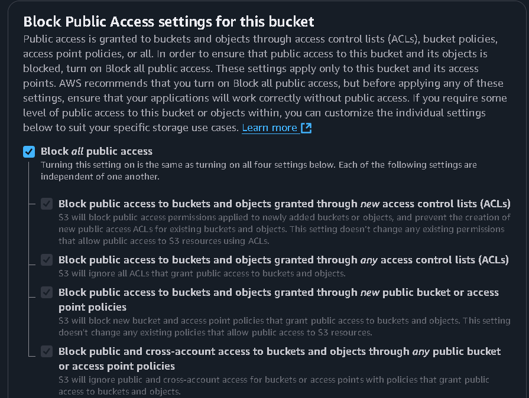

# CLOUD_SECURITY_IMPLEMENTATION

**COMPANY**: CODTECH IT SOLUTIONS 

**NAME**: M.S.G.N. SURYA VAIBHAV

**INTERN ID**: CT08IVH

**DOMAIN**: CLOUD COMPUTING

**BATCH DURATION**: JANUARY 20, 2025 to FEBRURAY 20, 2025

**MENTOR NAME**: NEELA SANTOSH

## **TASK**
- IMPLEMENT IAM POLICIES, SECURE STORAGE, AND DATA ENCRYPTION ON A CLOUD PLATFORM.
- DELIVERABLE: CONFIGURED SECURITY POLICIES AND A REPORT DETAILING THE SETUP

## **DESCRIPTION:-**

In this I am creating an IAM user and implemnting an policy that will granting the access to the EC2 and deny the access to the s3 for the first part of the task. for the second part of the task Not only will that IAM user I created be blocked, but I'm also going to make sure no one can access the files by blocking the public access. That's double-layered security – keeping both specific users and the general public out. For the third part of my task which is encription For S3, I'm enabling server-side encryption to protect the data at rest.  And on my EC2 instance, I'm adding a KMS key to encrypt the instance volume.  That way, even if someone were to somehow get access to the storage, the data would still be unreadable without the key.  It's all about making sure that even if one layer of defense falls, there are still more in place.

## **Procedure:-**

### IMPLIMENTING THE IAM POLICIES:

- search IAM and go to policies
- create an policy
- can do it with json and the visual
- I am doing it with the json
- [user-policies](User_policy.json)
- in this policy i have granted access to the ec2 and deny all the access to the s3
- this will make the user which attached to this policy to perfom any action in the EC2 but cant do any actions in the s3 cause of the explit deny
- to test this create an user and give an name to the user
- And add this policy to the user and click on custom password give an password

  
- There would an link that give access to the IAM user access it and try to do any change in ec you can do it
  
- Now try to create something in the s3 it will say view your permissions
  

### SECURING STORAGE :

### **CREATE S3 :-**

1.**Disable ACL's**
- search the amazon s3 in services
- create an bucket
- give an name to the bucket -> genral purpose
- Control ownership of objects written to this bucket from other AWS accounts and the use of access control lists (ACLs). Object ownership determines who can specify access to objects.
- This will make All objects in this bucket are owned by this account. Access to this bucket and its objects is specified using only policies.
  <image src="ACLs_diable.png">
  
2.**Blocking all pulic access:-**
- this include the same steps as the upper experment
- create an s3 bucket
- enter the name to the s3 bucket which is globally availble
- disable or enable the acl's
- there is an option where vlock all public access mark that section
  

3.**Disable the iam access:-**
- create an iam policy
- go to policies -> create
- visual -> select s3 service -> access to deny
- all the resources block
- then this will block the access to the users who are assosated with this policy
- The policy should be looking like this -> [deny](s3_deny.json)
- If you try to access the s3 bucket from the IAM user this will show this 
  
### DATA-ENCRYPTION:-
- At the top of AWS Management Console, in the search box, search for and choose S3 to open the Amazon S3 console.

- In the navigation pane, choose Buckets.

- Choose the link for the bucket name that contains imagebucket.

- Choose the Properties tab.

- In the Default encryption section, notice the setting Server-side encryption is automatically applied to new objects stored in this bucket.

- Note: Amazon S3 now applies server-side encryption with Amazon S3 managed keys (SSE-S3) as the base level of encryption for every bucket in Amazon S3.

- Next, you upload a file to the bucket.

- At the top of the page, choose the Objects tab.

- Choose Upload.

- Choose Add files.

- Browse to and select the clock.png file that you downloaded to your computer.

- Expand the Permissions option.

- Choose Grant public-read access.

- acknowledge the warning, select I understand the risk of granting public-read access to the specified objects.

- At the bottom of the page, choose Upload.

- After the upload completes, in the upper-right corner, choose Close.

- The clock.png file is now listed as an object in the bucket.

- To open the file properties, choose the clock.png file.

- In the Server-side encryption settings section, notice the following settings: 

- This encryption setting is enabled, and the following message is displayed: Server-side encryption protects data at rest.

- For Encryption type, the following message is displayed: Server-side encryption with Amazon S3 managed keys (SSE-S3).

- To open the image, in the Object overview section, choose the Object URL. 

- You can use this method to access an Amazon S3 object from the public internet.

- The clock image opens in a browser tab. 

> [!Note]
> The object is encrypted, but while it displays, it has to be decrypted. The service handles this decryption transparently.

In this task, We reviewed the encryption settings on the bucket. Then uploaded an object to the bucket and accessed the object by using a public link for the object. Amazon S3 transparently decrypted the object before displaying it in the browser.
