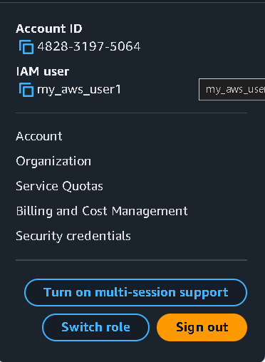

# CLOUD_SECURITY_IMPLEMENTATION

**COMPANY**: CODTECH IT SOLUTIONS 

**NAME**: M.S.G.N. SURYA VAIBHAV

**INTERN ID**: CT08IVH

**DOMAIN**: CLOUD COMPUTING

**BATCH DURATION**: JANUARY 20, 2025 to FEBRURAY 20, 2025

**MENTOR NAME**: NEELA SANTOSH

## **TASK**
- IMPLEMENT IAM POLICIES, SECURE STORAGE, AND DATA ENCRYPTION ON A CLOUD PLATFORM.
- DELIVERABLE: CONFIGURED SECURITY POLICIES AND A REPORT DETAILING THE SETUP

## **DESCRIPTION:-**

In this I am creating an IAM user and implemnting an policy that will granting the access to the EC2 and deny the access to the s3 for the first part of the task. for the second part of the task Not only will that IAM user I created be blocked, but I'm also going to make sure no one can access the files by blocking the public access. That's double-layered security – keeping both specific users and the general public out. For the third part of my task which is encription For S3, I'm enabling server-side encryption to protect the data at rest.  And on my EC2 instance, I'm adding a KMS key to encrypt the instance volume.  That way, even if someone were to somehow get access to the storage, the data would still be unreadable without the key.  It's all about making sure that even if one layer of defense falls, there are still more in place.

## **Procedure:-**
### IMPLIMENTING THE IAM POLICIES:
- search IAM and go to policies
- create an policy
- can do it with json and the visual
- I am doing it with the json
- [user-policies](User_policy.json)
- in this policy i have granted access to the ec2 and deny all the access to the s3
- this will make the user which attached to this policy to perfom any action in the EC2 but cant do any actions in the s3 cause of the explit deny
- to test this create an user and give an name to the user
- And add this policy to the user and click on custom password give an password
  
- there would an link that give access to the IAM user access it and try to do any change in ec you can do it
  
- Now try to create something in the s3 it will say view your permissions
  
### SECURING STORAGE :
